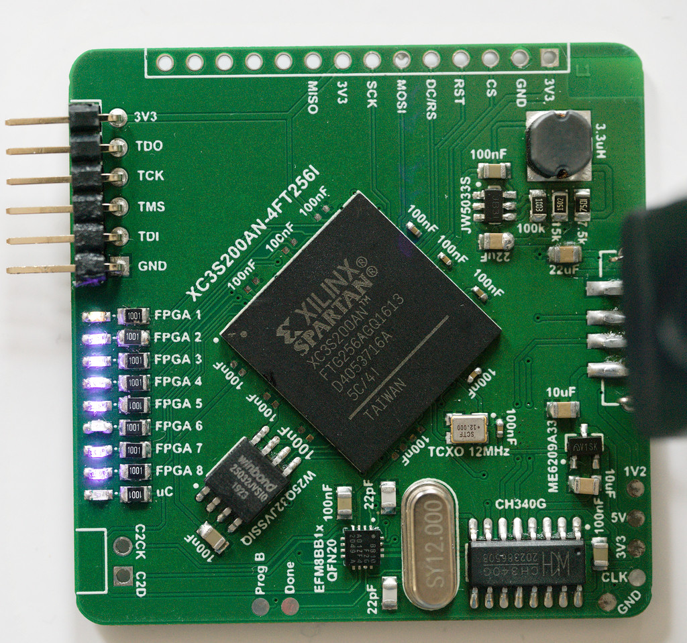

# AltiumProjects

## Spartan3_TestBoard

### Purpose
- Validate functionality of flashing FPGA via Xilinx programming tool and software environment (ISE Design Suite)
- Validate functionality of CH340G USB/Serial converter
- Validate functionality of SPI 32Mbyte flash IC
- Validate 1.2V switching regulator circuit

### Status
- 1.2V switching regulator works
- FPGA successfully works with simple blinking demo code
- <s>CH340G crystal is not powering up correctly, USB connection not working</s> => accidentally mixed up USB A Female & USB A Male pinout
- EFM8BB1 programming via C2 interface and Simplicity Studio successfull
- EFM8BB1 UART transmission via CH340G works

## CH340G_Test

### Purpose
- Validate functionality of USB/Serial converter IC *CH340G*

### What does it do?
- Reads temperature data from a DS18B20 temperature sensor
- Transmits temperature data via USB to a serial communication port of a PC

### Implementation Details
#### Software
- 8-Bit microcontroller *STM8L051F3* implements 1-Wire interface to be able to communicate with DS18B20
- UART transmission from STM8 to CH340G
- Written in C
#### Hardware
- USB port is used to transmit data from PCB to PC and also to supply power (5V)
- 5V are reduced to 2.8V by the use of a low dropout voltage regulator (ME6209A-Series)
- In-Circuit programming and debugging port (STM's SWIM interface)
- Schematic & PCB designed done with Altium Designer (Student License) 
- Used Wuerth Electronics' and Celestial's Altium Libraries
- Gerber file export to JLCPCB and / or OSHPark for production
