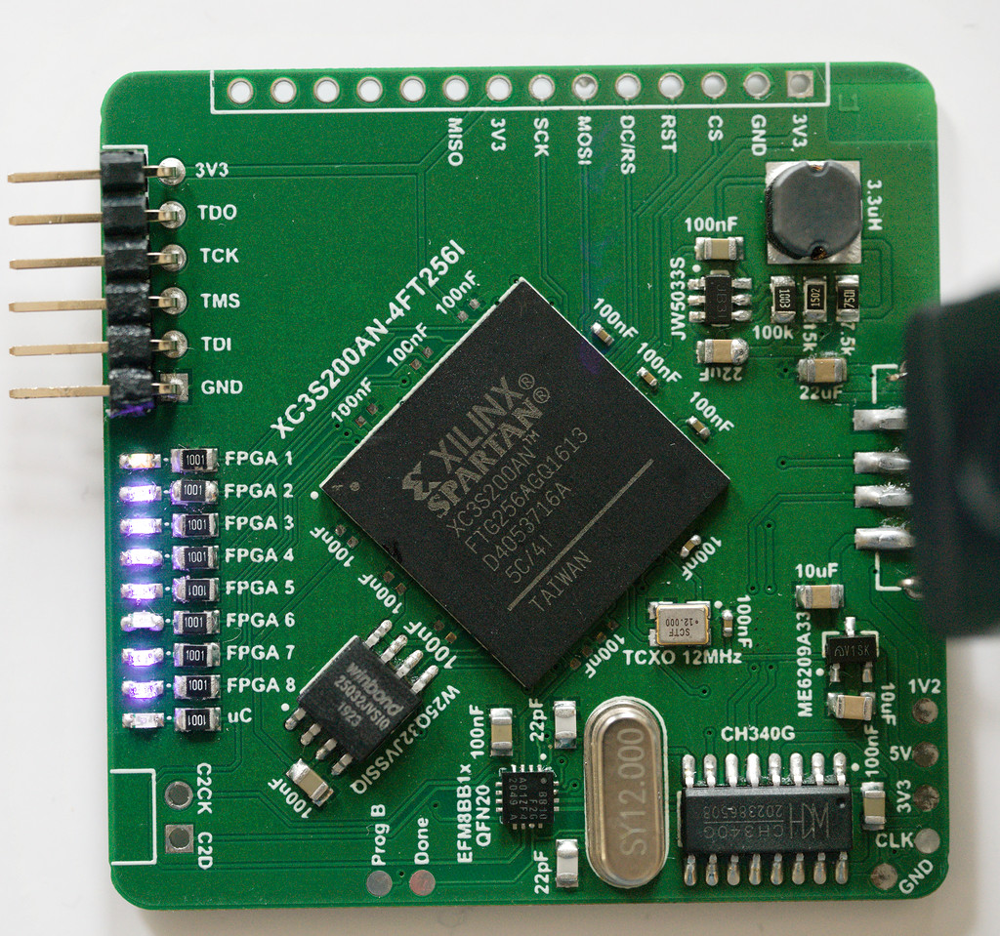
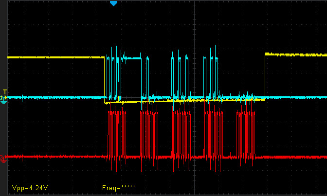

## Spartan3_TestBoard

**PCB v1.0** 

**EFM8BB1 SPI Transmit Recording** 

### Purpose
- Validate functionality of flashing FPGA via Xilinx programming tool and software environment (ISE Design Suite)
- Validate functionality of CH340G USB/Serial converter
- Validate functionality of SPI 32Mbyte flash IC
- Validate 1.2V switching regulator circuit

### Status
- 1.2V switching regulator works
- FPGA successfully works with minimal [32-bit MIPS-CPU](https://github.com/Bresenham/AltiumProjects/tree/master/Spartan3_TestBoard/CPUVHDL)
- <s>CH340G crystal is not powering up correctly, USB connection not working</s> => accidentally mixed up USB A Female & USB A Male pinout
- EFM8BB1 programming via C2 interface and Simplicity Studio successfull
- EFM8BB1 UART transmission via CH340G works
- EFM8BB1 SPI transmission to Winbond Flash IC works
